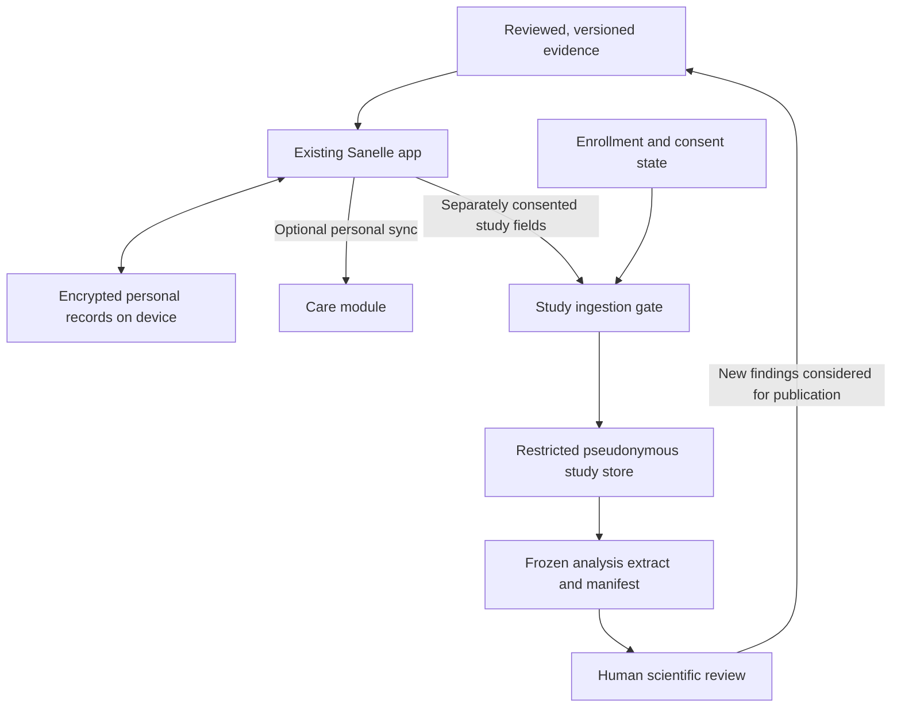

# Sanelle: using evidence to deliver value and trustworthy longitudinal data

**Architecture recommendation, 7 October 2026.** This is an advisory design grounded in the current Angular/Ionic client, adjacent Spring Boot backend, and [research-to-product specification](../research/Sanelle-research-to-product-plan-2026-10-06.md). It proposes changes; it does not implement or validate them. Preserve the app's existing visual identity.

## 1. The decision

Make Sanelle help people **understand what they were told, prepare for a healthcare conversation, and remember what happens next**. The research library should improve those tasks. Research participation should let a separately defined study learn from longitudinal experiences without becoming a condition of personal usefulness.

Distinguish three assets:

| Asset | Job | Boundary |
|---|---|---|
| Published evidence | Support reviewed explanations and discussion prompts | A population result is not an individual prediction |
| Personal records | Remember reports, symptoms, questions, answers and plans | Patient confirmation of transcription is not clinician verification |
| Consented study observations | Answer a prespecified question with reproducible analysis | App users are not automatically a representative population |

The library currently records 56 original main-text readings and 44 mapped claims. Twelve selected originals remain incomplete, and wider screening and independent appraisal remain unfinished. These are useful inputs to content development, not a complete systematic review or a clinical approval stamp. See the [library status](../research/README.md).

## 2. Turn each input into an output

| What someone gives Sanelle | Immediate personal output | Later output |
|---|---|---|
| A report or report finding | Original wording beside a reviewed explanation; visible unknowns | A dated finding in the visit summary |
| A concern | First item in the appointment summary | A record of whether it was discussed |
| A question | A selected question for a particular visit | A dated answer, deferred question or unresolved issue |
| A check-in | A timeline entry with symptom and daily-life impact | A selected-period summary with coverage and missingness |
| A visit review | What was explained and agreed, in the person's words | A next step, contact or review point that can be retrieved |
| Meal preferences | Suitable recipes and swaps | A practical plan and editable shopping list |

Show the destination beside the action: “Saved to your next doctor's visit”, “Included in your 30-day symptom summary”, or “Added to your shopping list.” These statements must match actual selections; a check-in excluded from the visit summary must not be described as included.

Support different entry points: a new diagnosis, changing symptoms, a routine review, or follow-up after treatment. Do not require a full report, a daily diary, a reproductive goal or meal use to produce a useful summary. A concern and one question can be enough.

An illustrative flow: a person enters a report that does not mention location. Sanelle preserves that unknown and offers “Where are my fibroids?” for their chosen visit. Selected symptom observations can accompany that question. Afterward, the person records the explanation and any agreed next step. The app helps retrieve that account later. It does not infer location or choose treatment.

## 3. Build a versioned evidence catalog from the research library

Extend the existing `EvidenceTopic` model rather than putting the entire dossier into runtime prompts. Keep the detailed library for audit and authoring; ship short, reviewed content appropriate to the user's task.

Each published claim needs:

- Stable claim ID and content version, linked to source IDs and URLs.
- The population, outcome, intervention/exposure and study designs supporting it.
- A plain-language statement, limitations and boundaries on interpretation.
- An explicit uncertainty assessment and its method; the current narrative confidence labels must not be called formal GRADE assessments.
- Research cutoff, accountable reviewer, review date and publication state.
- Linked app locations, discussion prompts and any rule using the claim.
- Supersession or withdrawal history so outdated wording can be located and replaced.

Keep outcomes distinct. Evidence about developing fibroids must not become a claim about shrinking existing fibroids, symptom relief or fertility. Apply the catalog to report explanations, treatment information, statistics descriptions, meal copy and notifications—not only the Learn section. The existing food-topic service already filters drafts out of production; medical explanations also exist directly in the finding definitions and need a consistent review policy.

Use a release process: research draft → scientific/clinical review appropriate to the claim → approved version → publication. A boolean flag or a person's name in a string is insufficient evidence that review happened. Store the reviewed scope and decisions. Link each generated discussion prompt to its rule and content version.

Start with deterministic rules for presentation and preparation. For example, a missing finding can suggest a question; it cannot generate a diagnosis. Do not ship a growth, fertility or treatment-benefit prediction because a paper contains a model. That requires separate validation in the intended population and use context.

AI could later assist explanation or text extraction using approved content and explicit provenance. Evaluate unsupported statements, ambiguous units and abstention before release. Patient documents and external source text are data, never executable instructions. Keep clinical advice and publishing decisions under the defined review process.

## 4. Evolve the personal record around dated encounters

The current model already includes reports, questions, symptoms, visits and tasks. Improve their relationships rather than recreating the existing features.

| Proposed model | Main addition | Why it matters |
|---|---|---|
| Encounter | Stable ID, date, status; links to selected concern, questions and reports | Stops “next visit” from being an undated global bucket |
| Question and answer | Selected/discussed/answered/deferred status; encounter link; answer date and reported source | An unanswered question can be deliberately carried forward |
| Visit summary snapshot | The exact selected content and evidence versions saved before a visit | Later edits do not rewrite what someone brought to that visit |
| Observation revision | Stable ID, observed date, recorded time, schema version and superseded revision | Edits remain understandable; retrospective entry is visible |
| Report and measurement | Report date, original wording, optional parsed dimensions and explicit units | Makes comparisons possible without inventing units |
| Reported plan | Next step, who reportedly said it, review point, uncertainty and task links | Monitoring or reassurance can be a legitimate recorded outcome |

Preserve raw wording during normalization. “Multiple” is not a numeric count; “1.3” without a unit is not automatically centimetres. If detailed imaging tracking becomes necessary, use lesion identifiers and explicit matching status. Do not compare two reports' largest measurements as though they necessarily refer to the same lesion or show definite biological change.

Migrate the current version-1 local record explicitly and preserve the original until migration succeeds. Avoid adding advanced imaging fields to the everyday form before they have a personal or study purpose. Structured research detail can remain optional and study-specific.

## 5. Give statistics an honest meaning

Separate personal descriptions, product-usage metrics and study analyses. They have different denominators and interpretations.

For a 30-day period with 12 check-ins, ten bleeding responses and three heavy/very-heavy responses, show:

> You checked in on 12 of 30 days. Of the 10 check-ins with a bleeding answer, 3 recorded heavy or very heavy bleeding. Bleeding was not recorded on 2 check-ins; days without a check-in are unknown.

The current summary excludes unlogged dates and describes missing fields, which is a useful foundation. It nevertheless constructs its “of n check-ins” wording from all check-ins. Make each field's response denominator explicit and test partial entries. Display observations as recorded; do not interpolate missing days into symptom-free days or interpret a chart as a treatment effect.

For personal trends, show treatment changes and other voluntarily recorded context as dated annotations. Differences before and after an event can support a conversation; they do not establish causation. Avoid a composite “fibroid health score” with no validated meaning.

For research, define the outcome and unit of analysis before collecting data. Preserve participant, observation and cycle counts separately. Record missingness, late entry and loss to follow-up; account for repeated observations from the same person. A large number of check-ins from a small number of people is still a small participant sample.

Create a data dictionary with definitions, units, allowed values, missing reasons, provenance and schema versions. Where appropriate, reuse established data elements after checking fit. Standardized definitions support accurate exchange; they do not automatically validate Sanelle's questionnaire. [NLM discussion of health-data standardization](https://www.nlm.nih.gov/oet/ed/cde/tutorial/01-100.html).

## 6. Extend the existing backend in modules

Retain Angular/Ionic/Capacitor, Spring Boot and PostgreSQL. My recommendation is one deployable backend with explicit module ownership and interfaces. This reduces operational work while allowing later separation if actual scale or access requirements justify it. Spring documents module APIs, internal implementation boundaries and declared dependencies; adopting the architecture does not require adding Spring Modulith immediately. [Spring module fundamentals](https://docs.spring.io/spring-modulith/reference/fundamentals.html).

| Module | Owns | Access boundary |
|---|---|---|
| Identity | Accounts, authentication, sessions | Does not expose the identity-to-study link to ordinary analysts |
| Evidence | Reviewed claim versions and publication | Authoring and publishing permissions distinct from reading |
| Care | Optional synchronized personal records and encounters | Owner-based access to every record |
| Meals | Recipes, plans, restrictions and preparation events | Per-account preferences/progress |
| Studies and consent | Eligibility, enrollments, consent versions and field scopes | Study-specific participation; no inherited permission from login |
| Research ingestion and export | Permitted structured observations and frozen extracts | Pseudonymous data, restricted roles and export audit |

Proposed flow:

Research participation must work independently of whether someone wants a cloud copy of their full personal record. Do not route all patient documents through the research store. Personal synchronization and research transfer are different capabilities and permissions.

Keep the identity-link store access separate from the study store. A separate schema is a starting organizational boundary only if credentials, grants and application permissions enforce it; schema names alone do not provide separation. Use a separate database or service if governance requires a stronger boundary. Pseudonymization is not a guarantee of anonymity.

Check ownership and purpose authorization on every request, including exports and files. Default to denying access when permission cannot be established. These are established authorization principles, not a certification of the current implementation. [OWASP authorization guidance](https://cheatsheetseries.owasp.org/cheatsheets/Authorization_Cheat_Sheet.html).

## 7. Make offline behavior and research consent reliable

The inspected health storage is encrypted and account-scoped on the device. A cloud account does not currently imply that these health records are recoverable on another device. Explain the current storage behavior, provide a deliberate export/recovery path, and introduce opt-in backup or synchronization only with an explicit design.

For future synchronization:

- Persist local updates durably before acknowledging them. Use a durable queue with stable operation IDs and idempotent retries.
- Separate observed date from recorded time and server receipt time. Use explicit versions to detect conflicting edits; show a meaningful resolution instead of silently overwriting clinical notes.
- Preserve unreadable stored data and offer recovery. The current fallback to an empty record must not make a subsequent save overwrite the only recoverable copy without a deliberate recovery decision.
- Use tombstones for synchronized deletion so an older device cannot resurrect deleted items. Define backup retention and deletion behavior separately.
- Recheck account identity and server-side consent at ingestion and export. Offline queued observations must not bypass a later withdrawal or field restriction.
- On offline withdrawal, stop local study queuing immediately and show server withdrawal as pending until acknowledged. Specify how already transferred observations and frozen datasets are handled in the study's approved rules; do not promise a universal retrospective deletion outcome.

A study payload should default to structured fields only. Exclude original report files, intimate question text and free-form visit notes unless a study has a specific justified, separately authorized need. Research refusal must retain personal features.

Before enrollment, finalize the study question, recruitment, measurements, institutional/ethical requirements, permissions, retention and withdrawal handling. The existing specification's feasibility studies are proposals, not approved or completed studies.

## 8. Meals should earn their place through practical help

Use the evidence to keep meal claims accurate, and use the user's preferences to make food easier to choose and prepare. Center the section on today's meals, photographs, preparation time, usable ingredients, swaps preserving exclusions, and a shopping list.

Explain recommendations using actual criteria: “Fits your vegetarian preference and takes 15 minutes.” Do not turn observational dietary findings into claims that a particular recipe will shrink fibroids or balance hormones.

The current meal-progress service uses a global `cooked_meals` key and updates UI state before asynchronous persistence completes. Authentication code clears cached progress on registration and detected account changes; that mitigation means a data leak cannot be concluded from the key alone. Replace clearing-dependent ownership with durable per-account storage, await persistence, and verify loading/clearing races and failure recovery.

Keep planned, prepared and any future consumed events distinct. Existing cooking ticks can measure preparation engagement. They cannot retrospectively become validated dietary intake or treatment adherence. Collect intake detail only when a defined study justifies its burden.

## 9. Delivery order and acceptance criteria

| Order | Deliverable | Evidence needed to accept it |
|---|---|---|
| 1 | One complete appointment journey | Concern/question → selected summary → dated answer/deferred status → reported plan → later retrieval works without a full diary |
| 1 | Data integrity and honest personal statistics | Partial-field denominators; migration/recovery; account changes and storage failures tested with meaningful cases |
| 1 | Reviewed evidence connected to actual features | Every released medical explanation and rule traces to an approved version; draft content cannot be published through an alternate UI path |
| 2 | Meal utility and a small appointment pilot | Observe whether users can choose/swap/shop and use/retrieve their visit material; record burden, confusion and missing follow-up |
| 2 | Deliberate personal backup/sync capability | Existing device-only users are not silently uploaded; retry/conflict/deletion and restore tests pass |
| 3 | A reviewed prospective study and consented ingestion | Declined/withdrawn/expired or out-of-scope consent blocks transfer; ownership, retries, edits and exports are verified |
| 3 | Reproducible study analysis | Frozen extract with protocol, dictionary, cutoff, cohort flow, missingness, consent handling, transformations and version hashes |

The first study should establish whether the appointment journey is usable and helps people recall what was discussed. A later longitudinal study can describe reported burden and variation in an explicitly recruited cohort. A causal claim about the app or diet requires a separate suitable study design.

Measure product success through questions actually discussed, clarity and later retrieval of the reported plan, capture burden, and successful meal tasks. Report numerators and denominators. Engagement volume alone cannot establish benefit.

## 10. Inspection scope and verification

Inspected source anchors: [finding and personal-record model](../../src/app/my-health/diagnosis.model.ts), [health repository](../../src/app/my-health/health-repository.ts), [summary calculations](../../src/app/my-health/summary.ts), [account-record storage](../../src/app/core/storage/account-record-store.ts), [meal progress](../../src/app/core/services/meal-progress.service.ts), [authentication clearing](../../src/app/core/auth/auth.service.ts), [evidence model](../../src/app/learn/evidence.model.ts), [topic visibility](../../src/app/learn/evidence-topics.service.ts), and [local report reader](../../src/app/my-health/report/report-reader.service.ts). The adjacent backend's package/configuration and controller/entity inventory were also inspected. No deployed-service, penetration, end-to-end clinical or independent scientific audit was performed.

This recommendation extends the [existing product/research plan](../research/Sanelle-research-to-product-plan-2026-10-06.md) with module boundaries, encounter relationships, evidence versions, offline/recovery behavior and a consented research path. It leaves runtime code unchanged. Local document links are checked separately; the engineering and research acceptance criteria above remain future work.
