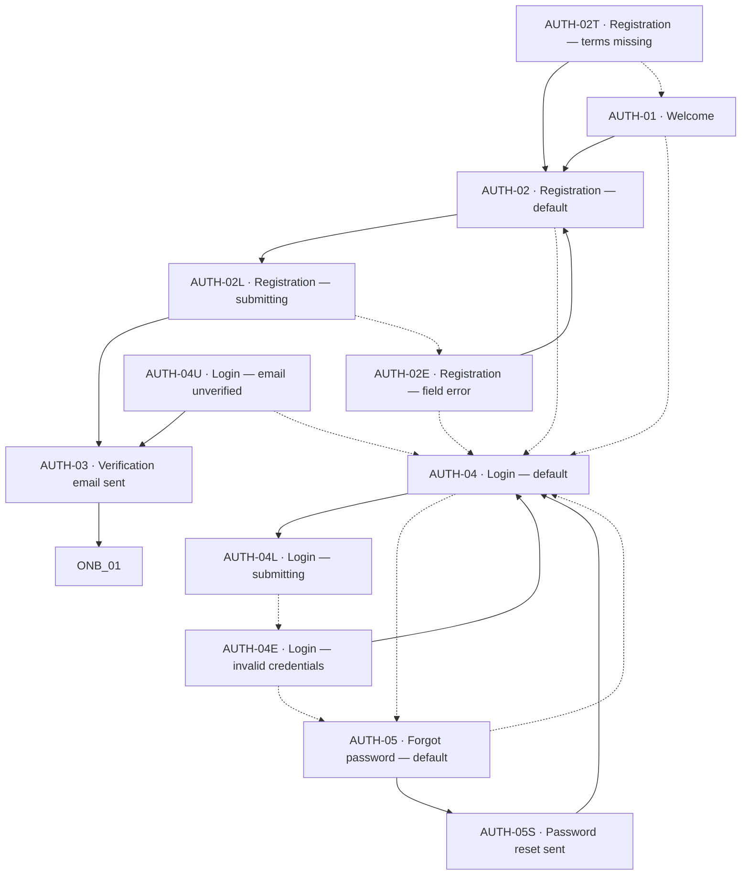
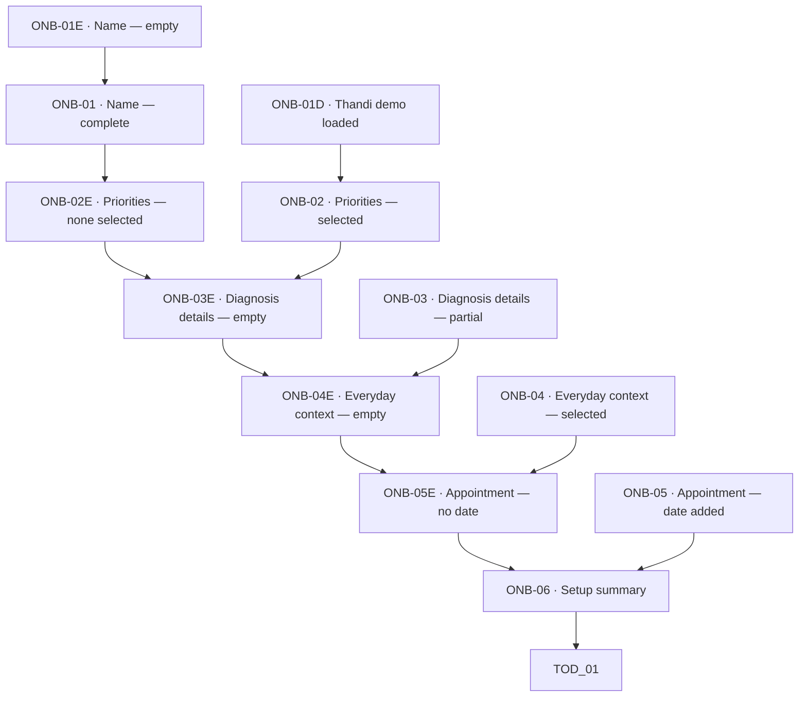
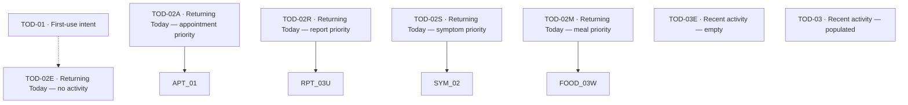
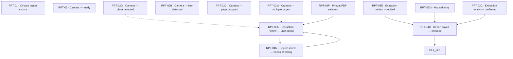
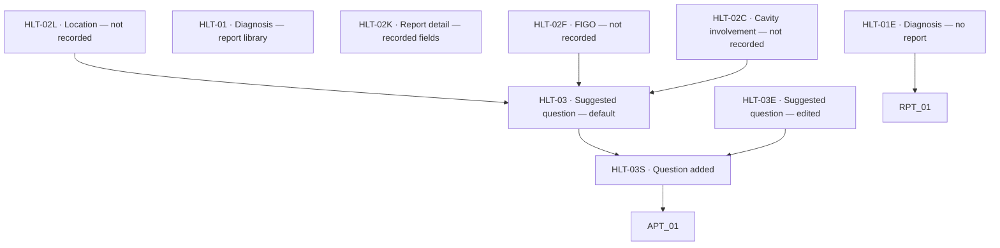
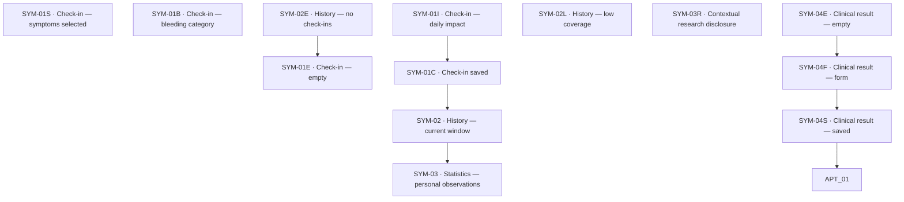
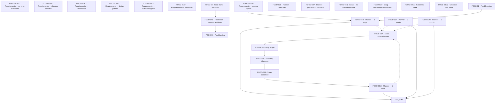
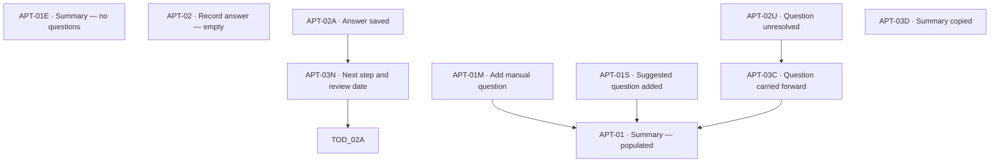
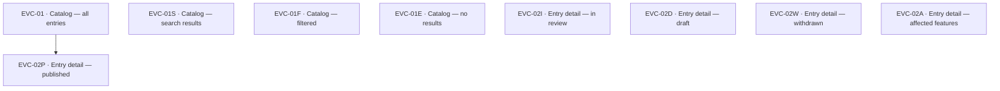

# Sanelle complete journey and state map

This document maps all **111** visual screen and state artboards in `SANELLE_COMPLETE_SCREEN_ATLAS.pdf`.

Each table row includes the entry point, primary transition, and alternate transition. Mermaid diagrams show transitions whose target screen IDs are explicit in the inventory.

## Account

| ID | Screen or state | Entry from | Primary transition | Alternate transition |
|---|---|---|---|---|
| AUTH-01 | Welcome | App launch | Create account → AUTH-02 | Log in → AUTH-04 |
| AUTH-02 | Registration — default | AUTH-01 | Submit → AUTH-02L | Log in → AUTH-04 |
| AUTH-02L | Registration — submitting | AUTH-02 | Success → AUTH-03 | Failure → AUTH-02E |
| AUTH-02E | Registration — field error | AUTH-02L | Correct field → AUTH-02 | Log in → AUTH-04 |
| AUTH-02T | Registration — terms missing | AUTH-02 | Accept → AUTH-02 | Back → AUTH-01 |
| AUTH-03 | Verification email sent | AUTH-02L | Verified → ONB-01 | Resend / log in |
| AUTH-04 | Login — default | AUTH-01 | Submit → AUTH-04L | Forgot password → AUTH-05 |
| AUTH-04L | Login — submitting | AUTH-04 | Success → TOD-02 | Failure → AUTH-04E |
| AUTH-04E | Login — invalid credentials | AUTH-04L | Retry → AUTH-04 | Reset → AUTH-05 |
| AUTH-04U | Login — email unverified | AUTH-04L | Resend → AUTH-03 | Back → AUTH-04 |
| AUTH-05 | Forgot password — default | AUTH-04 | Send → AUTH-05S | Back → AUTH-04 |
| AUTH-05S | Password reset sent | AUTH-05 | Return → AUTH-04 | Resend |

## Onboarding

| ID | Screen or state | Entry from | Primary transition | Alternate transition |
|---|---|---|---|---|
| ONB-01E | Name — empty | AUTH-03 | Enter name → ONB-01 | Preview demo |
| ONB-01 | Name — complete | ONB-01E | Continue → ONB-02E | Back |
| ONB-01D | Thandi demo loaded | ONB-01E | Continue → ONB-02 | Clear demo |
| ONB-02E | Priorities — none selected | ONB-01 | Continue → ONB-03E | Select priorities |
| ONB-02 | Priorities — selected | ONB-02E | Continue → ONB-03E | Edit selection |
| ONB-03E | Diagnosis details — empty | ONB-02 | Continue → ONB-04E | Enter known details |
| ONB-03 | Diagnosis details — partial | ONB-03E | Continue → ONB-04E | Clear value |
| ONB-04E | Everyday context — empty | ONB-03 | Continue → ONB-05E | Choose context |
| ONB-04 | Everyday context — selected | ONB-04E | Continue → ONB-05E | Edit |
| ONB-05E | Appointment — no date | ONB-04 | Finish → ONB-06 | Add date |
| ONB-05 | Appointment — date added | ONB-05E | Finish → ONB-06 | Remove date |
| ONB-06 | Setup summary | ONB-05/05E | Open Sanelle → TOD-01 | Back |

## Today

| ID | Screen or state | Entry from | Primary transition | Alternate transition |
|---|---|---|---|---|
| TOD-01 | First-use intent | ONB-06 | Choose destination | Look around → TOD-02E |
| TOD-02E | Returning Today — no activity | App return | Choose task | Primary nav |
| TOD-02A | Returning Today — appointment priority | App return | Open summary → APT-01 | Primary nav |
| TOD-02R | Returning Today — report priority | App return | Continue → RPT-03U | Primary nav |
| TOD-02S | Returning Today — symptom priority | App return | History → SYM-02 | Log again |
| TOD-02M | Returning Today — meal priority | App return | Open plan → FOOD-03W | Primary nav |
| TOD-03E | Recent activity — empty | TOD-02E | Choose task | None |
| TOD-03 | Recent activity — populated | TOD-02A/R/S/M | Open event | None |

## Report

| ID | Screen or state | Entry from | Primary transition | Alternate transition |
|---|---|---|---|---|
| RPT-01 | Choose report source | HLT-01E/TOD-02R | Choose source | Close |
| RPT-02 | Camera — ready | RPT-01 | Capture | Cancel |
| RPT-02G | Camera — glare detected | RPT-02 | Retake | Use anyway → RPT-03U |
| RPT-02B | Camera — blur detected | RPT-02 | Retake | Cancel |
| RPT-02C | Camera — page cropped | RPT-02 | Retake | Cancel |
| RPT-02M | Camera — multiple pages | RPT-02 | Use pages → RPT-03U | Add page |
| RPT-02P | Photos/PDF selected | RPT-01 | Continue → RPT-03U | Remove file |
| RPT-03U | Extraction review — unchecked | RPT-02M/P | Confirm fields | Finish later → RPT-04N |
| RPT-03E | Extraction review — edited | RPT-03U | Save → RPT-04C | Undo correction |
| RPT-03M | Manual entry | RPT-01 | Save → RPT-04C | Cancel |
| RPT-03C | Extraction review — confirmed | RPT-03U/E | Save checked → RPT-04C | Back |
| RPT-04N | Report saved — needs checking | RPT-03U | Finish → RPT-03U | View source |
| RPT-04C | Report saved — checked | RPT-03C/M | Understand details → HLT-02K | Add report |

## My health

| ID | Screen or state | Entry from | Primary transition | Alternate transition |
|---|---|---|---|---|
| HLT-01E | Diagnosis — no report | Primary nav | Add report → RPT-01 | Symptoms tab |
| HLT-01 | Diagnosis — report library | Primary nav/RPT-04 | Open report | Add report |
| HLT-02K | Report detail — recorded fields | HLT-01 | Open explanation | Sources |
| HLT-02L | Location — not recorded | HLT-02K | Question → HLT-03 | Dismiss |
| HLT-02F | FIGO — not recorded | HLT-02K | Question → HLT-03 | Dismiss |
| HLT-02C | Cavity involvement — not recorded | HLT-02K | Question → HLT-03 | Dismiss |
| HLT-03 | Suggested question — default | HLT-02L/F/C | Save → HLT-03S | Dismiss |
| HLT-03E | Suggested question — edited | HLT-03 | Save → HLT-03S | Reset |
| HLT-03S | Question added | HLT-03/E | Open summary → APT-01 | Done |

## Symptoms

| ID | Screen or state | Entry from | Primary transition | Alternate transition |
|---|---|---|---|---|
| SYM-01E | Check-in — empty | Today/My health | Select observation | Close |
| SYM-01S | Check-in — symptoms selected | SYM-01E | Continue | Edit |
| SYM-01B | Check-in — bleeding category | SYM-01S | Continue | Clear answer |
| SYM-01I | Check-in — daily impact | SYM-01B | Save → SYM-01C | Back |
| SYM-01C | Check-in saved | SYM-01I | History → SYM-02 | Edit |
| SYM-02E | History — no check-ins | Symptoms tab | Log → SYM-01E | None |
| SYM-02 | History — current window | SYM-01C | Summary → SYM-03 | Add check-in |
| SYM-02L | History — low coverage | SYM-02 | Add check-in | Sources |
| SYM-03 | Statistics — personal observations | SYM-02 | Context cards | Prepare visit |
| SYM-03R | Contextual research disclosure | SYM-03 | Return | Sources |
| SYM-04E | Clinical result — empty | SYM-03 | Add result → SYM-04F | Back |
| SYM-04F | Clinical result — form | SYM-04E | Save → SYM-04S | Cancel |
| SYM-04S | Clinical result — saved | SYM-04F | Summary → APT-01 | Edit |

## Food

| ID | Screen or state | Entry from | Primary transition | Alternate transition |
|---|---|---|---|---|
| FOOD-01 | Food landing | Primary nav | Choose path | None |
| FOOD-01AE | Requirements — no strict exclusions | FOOD-01 | Continue | Add requirement |
| FOOD-01AA | Requirements — allergies selected | FOOD-01AE | Continue | Edit |
| FOOD-01AI | Requirements — intolerance | FOOD-01AA | Continue | Back |
| FOOD-01AD | Requirements — dietary pattern | FOOD-01AI | Continue | Back |
| FOOD-01AC | Requirements — cultural/religious | FOOD-01AD | Continue | Back |
| FOOD-01AH | Requirements — household | FOOD-01AC | Continue | Back |
| FOOD-01AR | Requirements — cooking rhythm | FOOD-01AH | Generate → FOOD-03D | Back |
| FOOD-02 | Flexible recipe | FOOD-01 | Plan → FOOD-03D | Back |
| FOOD-03D | Planner — 3 days | FOOD-01AR/02 | Save → TOD-02M | Swap → FOOD-03A |
| FOOD-03W | Planner — 1 week | FOOD-01AR/02 | Save → TOD-02M | Swap → FOOD-03A |
| FOOD-03T | Planner — 2 weeks | FOOD-01AR/02 | Save → TOD-02M | Swap → FOOD-03A |
| FOOD-03M | Planner — 1 month | FOOD-01AR/02 | Save → TOD-02M | Swap → FOOD-03A |
| FOOD-03E | Planner — open day | FOOD-03D/W/T/M | Choose meal | Leave open |
| FOOD-03P | Planner — preparation complete | FOOD-03D/W/T/M | Undo prep | Next day |
| FOOD-03A | Swap — preferred meals | FOOD-03D/W/T/M | Choose → FOOD-03B | Cancel |
| FOOD-03N | Swap — no compatible meal | FOOD-03A | Change filters | Cancel |
| FOOD-03V | Swap — needs ingredient review | FOOD-03A | Review ingredients | Choose another |
| FOOD-03B | Swap scope | FOOD-03A | Continue → FOOD-03C | Back |
| FOOD-03C | Grocery difference | FOOD-03B | Confirm → FOOD-03S | Cancel |
| FOOD-03S | Swap confirmed | FOOD-03C | Return → FOOD-03W | Undo |
| FOOD-03G1 | Groceries — Week 1 | FOOD-03T/M | Mark already have | Next week |
| FOOD-03G2 | Groceries — later week | FOOD-03T/M | Update list | Previous week |
| FOOD-04 | Food claim — summary | FOOD-01 | Sources → FOOD-04S | Done |
| FOOD-04S | Food claim — sources and limits | FOOD-04 | Done → FOOD-01 | Research method |

## Appointment

| ID | Screen or state | Entry from | Primary transition | Alternate transition |
|---|---|---|---|---|
| APT-01E | Summary — no questions | Primary nav | Add question | Back |
| APT-01 | Summary — populated | Primary nav/HLT-03S | Review question | Copy |
| APT-01M | Add manual question | APT-01/E | Add → APT-01 | Cancel |
| APT-01S | Suggested question added | HLT-03S | Open → APT-01 | Done |
| APT-02 | Record answer — empty | APT-01 | Save answer | Mark unresolved |
| APT-02A | Answer saved | APT-02 | Next step → APT-03N | Edit |
| APT-02U | Question unresolved | APT-02 | Carry → APT-03C | Add note |
| APT-03N | Next step and review date | APT-02A | Finish → TOD-02A | Skip date |
| APT-03C | Question carried forward | APT-02U | Summary → APT-01 | Resolve |
| APT-03D | Summary copied | APT-01 | Done | Copy again |

## Internal evidence

| ID | Screen or state | Entry from | Primary transition | Alternate transition |
|---|---|---|---|---|
| EVC-01 | Catalog — all entries | Internal role | Open → EVC-02P | Return |
| EVC-01S | Catalog — search results | EVC-01 | Open entry | Clear |
| EVC-01F | Catalog — filtered | EVC-01 | Open entry | Clear filters |
| EVC-01E | Catalog — no results | EVC-01S/F | Clear filter | New search |
| EVC-02P | Entry detail — published | EVC-01 | Review affected features | Back |
| EVC-02I | Entry detail — in review | EVC-01 | Review history | Back |
| EVC-02D | Entry detail — draft | EVC-01 | Continue drafting | Back |
| EVC-02W | Entry detail — withdrawn | EVC-01 | Review withdrawal | Back |
| EVC-02A | Entry detail — affected features | EVC-02P/I/D/W | Open feature list | Back |
