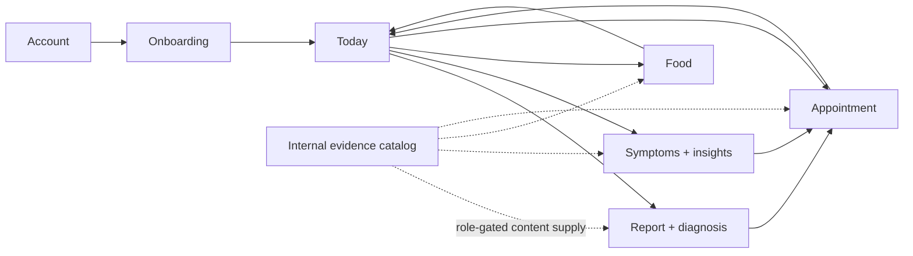
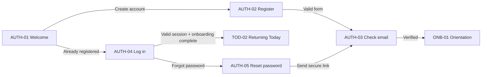
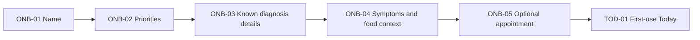
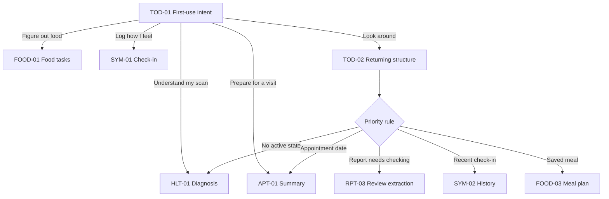
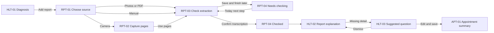
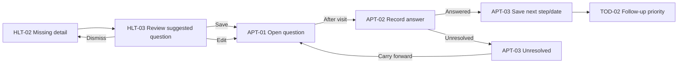
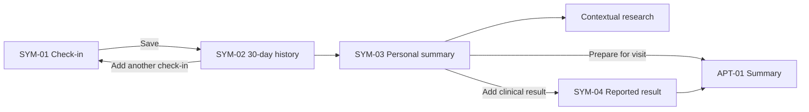
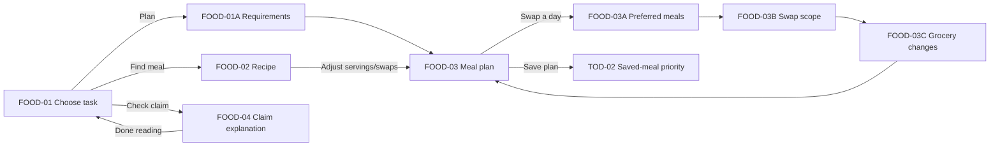
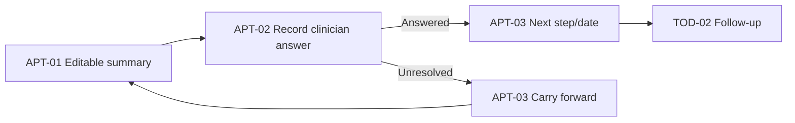
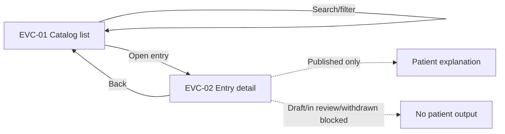

# Sanelle user journeys

Version: 1.0  
Product state: design prototype handoff  
Demo person: Thandi  

## How to use this document

- Every screen has a stable ID matching `SANELLE_SCREEN_MAP.csv`.
- Arrows describe product transitions, not technical routes.
- “Output” describes what becomes useful after the user acts.
- “Evidence rule” describes the content or data boundary that implementation must preserve.
- Screens marked **internal** must not appear in patient navigation.

## Global navigation

Patient navigation contains:

1. Today
2. Food
3. My health
4. Appointment

The evidence catalog is a separate, role-gated internal workspace.



---

## Journey 1: Account registration and return

### Goal

Create a secure account or return to saved information without mixing authentication with health onboarding.



| Screen | Purpose | Primary action | Output | Next |
|---|---|---|---|---|
| AUTH-01 | Explain Sanelle before requesting data | Create my account | Registration intent | AUTH-02 |
| AUTH-02 | Capture minimum credentials | Create account | Unverified account | AUTH-03 |
| AUTH-03 | Explain verification/reset email | Continue after verification | Verified session | ONB-01 |
| AUTH-04 | Restore an existing session | Log in | Authenticated session | TOD-02 or ONB-01 |
| AUTH-05 | Request password reset | Send reset link | Reset email state | AUTH-03 |

### Required states

- Invalid email.
- Password below minimum length.
- Terms not acknowledged.
- Email already registered.
- Unverified account.
- Reset requested without revealing whether an account exists.

---

## Journey 2: Minimal but complete onboarding

### Goal

Create enough context for personalisation without requiring fertility intentions, extensive medical history, or complete report details.



### Screen sequence

#### ONB-01 — Name and orientation

- Input: preferred first name.
- Secondary path: load Thandi demo details.
- Output: personal greeting.
- Next: ONB-02.

#### ONB-02 — Priorities

- Inputs: diagnosis, food, symptoms, appointment preparation.
- Multiple selection.
- No choice creates a medical recommendation.
- Output: initial ordering and shortcuts.
- Next: ONB-03.

#### ONB-03 — Known diagnosis details

- Inputs: number of fibroids and largest recorded size.
- Both optional.
- Empty values remain not recorded.
- Do not request inferred location, FIGO type, or cavity involvement.
- Next: ONB-04.

#### ONB-04 — Everyday context

- Inputs: symptoms the user may want to track and practical food needs.
- No fertility assumption.
- Output: check-in shortcuts and meal-selection criteria.
- Next: ONB-05.

#### ONB-05 — Optional appointment

- Input: optional appointment date.
- Output: Today priority and appointment reminder.
- Next: TOD-01.

---

## Journey 3: First-use and returning Today

### Goal

Answer:

1. What did I last do?
2. Where did that information go?
3. What is one useful thing I can do next?



### Priority order

1. User-saved appointment date.
2. Explicitly unfinished report review.
3. Latest symptom check-in.
4. Saved meal plan.
5. Flexible task chooser.

This is a workflow order, not a medical-risk ranking.

### TOD-03 — Recent activity

Chronological events can include:

- Check-in saved.
- Report added.
- Report checked.
- Visit question added.
- Meal plan saved.
- Reported clinical result saved.

Empty state:

> Nothing recorded yet. Actions you take will appear here.

---

## Journey 4: Scan, check, and understand a report

### Goal

Turn a source document into user-confirmed structured information without presenting OCR as clinician verification.



### RPT-01 — Choose source

Options:

- Take photos.
- Choose photos.
- Upload PDF.
- Enter details manually.

Required content:

- Privacy notice.
- Supported-file guidance.
- No promise of diagnostic interpretation.

### RPT-02 — Capture pages

Required states:

- Full page visible.
- Glare.
- Blur.
- Cropped edge.
- Missing page.
- Retake.
- Reorder.
- Remove.
- Add another page.

### RPT-03 — Check extraction

Every field displays:

- Original wording.
- Source page.
- Extracted value.
- Unit exactly as reported.
- Needs-checking status.
- Edit action.
- Not recorded option.

Confirmation copy:

> I compared these fields with the report and corrected any transcription errors.

Evidence rule: confirmation validates transcription only. It is not clinician verification.

### HLT-02 — Explanation

Pattern:

```text
Report field
Location

Recorded value
Not recorded

Explanation
Your saved report does not include a location.
Sanelle cannot determine it from the other fields.

Action
Add a question for my next doctor’s visit
```

Source disclosure is optional and secondary.

---

## Journey 5: Missing detail to resolved or carried-forward question



### Rules

- Never add every unknown automatically.
- Suggested wording must be editable.
- Save source: “Suggested from missing report detail.”
- Answers stay in the user’s own words.
- Unresolved is distinct from unanswered.
- Carry-forward retains prior history.
- Next steps and review dates are user-reported agreements, not Sanelle instructions.

---

## Journey 6: Check-ins, history, statistics, and research

### Goal

Make every check-in useful while retaining denominators, missingness, and evidence limits.



### SYM-01 — Check-in fields

- Symptoms.
- Bleeding category: none, light, moderate, heavy, very heavy.
- Daily-life impact.

Copy rule:

> These are your own categories. Sanelle does not convert them into millilitres or a diagnosis.

### SYM-02 — 30-day history

- One dot per calendar day.
- Recorded category uses semantic colour.
- No entry uses unknown grey.
- Days without entries are not symptom-free.
- The timeline never predicts the next symptom day.

### SYM-03 — Statistics

Required sentence structure:

> You checked in on **X of 30 days**. Of the **Y check-ins with a bleeding answer**, **Z recorded heavy or very heavy bleeding**.

Always show:

- Date window.
- Recorded-day denominator.
- Field-specific answer denominator.
- Missing-day count.
- Personal-history label.

Never:

- Convert categories into blood volume.
- Diagnose anemia.
- Estimate population prevalence from app users.
- Merge personal history with research statistics.

### Contextual learning rules

| Trigger | Patient explanation | Evidence boundary |
|---|---|---|
| Any symptom impact | Size and symptoms answer different questions | C11; no symptom attribution |
| Heavy bleeding or fatigue | Logs cannot diagnose anemia | C12; clinical assessment separate |
| Appointment preparation | Preserve concern and daily impact | C14–C15; app benefit remains a hypothesis |
| Missing days | Missing entries remain unknown | C37 |

### SYM-04 — Reported clinical result

Capture:

- Result name.
- Exact value.
- Unit.
- Test date.
- Source.

Do not interpret the result.

---

## Journey 7: Practical food planning and bounded evidence



### FOOD-01A — Safety, preferences, and cooking rhythm

Collect these as separate data:

1. Allergies.
2. Strict avoidances.
3. Intolerances.
4. Dietary pattern.
5. Religious or cultural requirements.
6. Dislikes.
7. Positive preferences.
8. Household requirements.
9. Plan-specific overrides.

Strict exclusions determine which meals are eligible. Preferences determine which eligible meals appear first.

Allergy copy must not promise that a recipe or preparation environment is safe:

> No peanut ingredient is listed in this recipe. Check product labels and cross-contamination information. Sanelle cannot guarantee that packaged ingredients or preparation environments are allergen-free.

If ingredient or cross-contact information is incomplete, mark:

> Needs your review

Do not silently classify the meal as compatible.

### FOOD-02 — Recommendation explanation

Use actual criteria:

- Preparation time.
- Dietary pattern.
- Serving count.
- Available ingredients.
- Saved practical preferences.

Example:

> Suggested because you chose quick meals and it can be adapted with simple swaps.

Never claim a recipe:

- Shrinks fibroids.
- Balances hormones.
- Improves fertility.
- Prevents recurrence.

### FOOD-03 — Planning versus preparation

Separate:

- Planning horizon: 3 days, 1 week, 2 weeks, or 1 month.
- One editable assignment per day.
- Open days with no meal or grocery commitment.
- Repeated meals and batch-cooking opportunities.
- Weekly grocery windows inside 2-week and monthly plans.
- Plan.
- Prepare.
- Shopping.
- Already have.
- Remove item.
- Add item.

A prepared-meal tick does not establish consumption, serving size, dietary exposure, or causal effect.

#### Duration behaviour

| Horizon | Calendar treatment | Grocery treatment |
|---|---|---|
| 3 days | Three detailed day cards | One 3-day list |
| 1 week | Seven-day strip | One weekly list |
| 2 weeks | Two calendar rows | Week 1 and week 2 lists |
| 1 month | Thirty-day calendar grouped by week | One grocery list per week |

Users can change a meal, leave a day open, or mark preparation complete without changing the medical or evidence model.

### FOOD-03A — Swap with preferred meals

Opening **Swap this meal** ranks eligible options:

1. Favourites.
2. Meals planned before.
3. Matches saved preferences.
4. Other compatible meals.

Each option shows:

- Photograph.
- Meal name.
- Preparation time.
- Servings.
- Leftover suitability.
- Why it matches.
- Ingredient-conflict status.

Preference actions:

- Save as favourite.
- Show more meals like this.
- Show fewer meals like this.
- Do not suggest again.
- Like the meal but not a specific ingredient.

An allergy or strict avoidance always overrides favourite status.

### FOOD-03B — Swap scope

When the meal repeats, ask:

- This day only.
- Every occurrence this week.
- Every occurrence in this plan.

The selected scope must be visible before confirmation.

### FOOD-03C — Grocery change confirmation

Before applying the swap, show:

- Ingredients added.
- Ingredients removed.
- Ingredients retained because another meal still needs them.
- Updated week and serving quantity.

Example:

> This swap adds tofu and spring onions to Week 2’s shopping list.

Confirmation:

> Meal swapped. Week 2’s shopping list has been updated.

### FOOD-04 — Evidence explanation

Current reviewed example:

> No reliably established whole-food regimen that removes fibroids was demonstrated in this bounded review.

Always distinguish:

- Incidence.
- Measured growth.
- Symptoms.
- Supplement intervention.
- Fertility outcomes.

---

## Journey 8: Appointment preparation and post-visit follow-up



### Appointment summary content

- Recorded diagnosis details.
- Missing report details.
- Recent symptoms and impact.
- Reported clinical results.
- User-saved questions.
- Answers.
- Unresolved questions.
- Agreed next step.
- Review date.

The summary contains only user-entered or user-confirmed details.

The usefulness of an appointment summary is a product hypothesis to test, not an established clinical benefit.

---

## Journey 9: Internal evidence governance

### Separation

The catalog is not part of patient navigation. Access is role-gated.



### EVC-01 list requirements

- Search title, ID, explanation.
- Filter topic.
- Filter status.
- Show version and number of affected features.
- Empty result state.

### EVC-02 detail requirements

- Title.
- Plain-language explanation.
- Sources and citations.
- Population.
- Outcome.
- Findings.
- Limitations and uncertainty.
- Reviewer.
- Review date.
- Version.
- Research cutoff.
- Publication status.
- Review history.
- Used-by features and prompts.

### Publication rules

- Draft: internal only.
- In review: internal only.
- Published: eligible for patient-facing use.
- Withdrawn: retained for audit history; removed from patient outputs.

---

## Shared empty and incomplete states

| Context | Empty or incomplete copy | Next action |
|---|---|---|
| Today activity | Nothing recorded yet. Actions you take will appear here. | Choose a task |
| Reports | No report files saved yet. | Add report |
| Report extraction | Details still need checking. | Continue review |
| Symptom history | No check-ins yet. | Log symptoms and impact |
| Statistics | 0 of 30 days recorded; remaining days unknown. | Add check-in |
| Clinical results | No reported result saved. | Add exact result |
| Appointment questions | No questions saved yet. | Add in own words or review suggestion |
| Food plan | No meal planned. | Find by time, ingredients, preference |
| Evidence filters | No entries match. | Clear filter or change search |

---

## Analytics events for implementation planning

These events describe product use, not research consent.

| Event | Key properties |
|---|---|
| account_created | method, verification_state |
| onboarding_completed | selected_priorities, optional_fields_completed |
| report_source_chosen | camera, photos, pdf, manual |
| report_review_saved | checked_fields, missing_fields, finish_later |
| suggested_question_viewed | source_field |
| suggested_question_saved | edited_before_save |
| check_in_saved | answered_fields, not clinical interpretation |
| symptom_history_viewed | recorded_days, date_window |
| meal_plan_saved | servings, swaps, list_count |
| appointment_summary_viewed | question_count, unresolved_count |
| clinician_answer_saved | status, next_step_present, review_date_present |

Do not send report text, symptom values, question text, or clinical results to general analytics.
